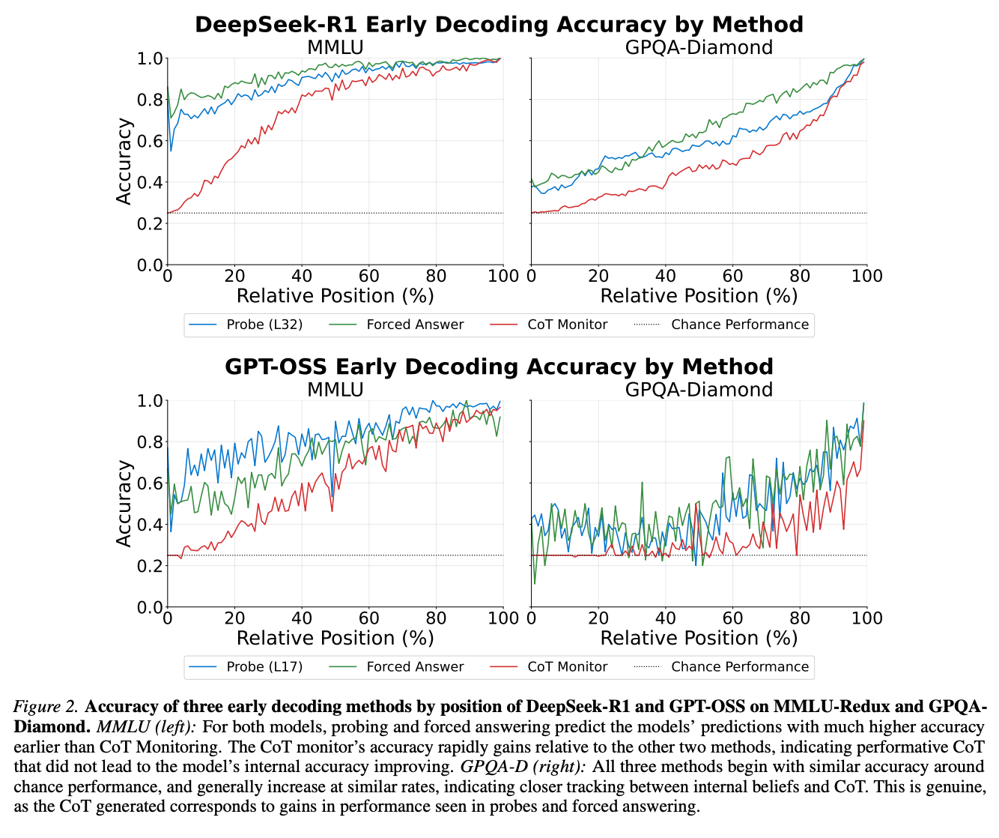

# Backstage Reasoning



_Starting point: [Reasoning Theater](https://arxiv.org/abs/2603.05488)
shows a gap between what is already decodable from model internals and what the
visible reasoning trace has revealed._

Backstage Reasoning studies whether hidden-state and action-continuation
signals can reveal where an agent trajectory is going before the visible
reasoning makes that direction legible.

The core question is:

> In a grounded agent environment, can we tell early whether visible reasoning is
> keeping up with the safety-relevant direction of the run?

## Motivation

Reasoning Theater gives us the methodological starting point: compare the
visible trace with stronger signals such as activation probes and forced
continuations. This project moves that idea from answer letters toward grounded
agent trajectories.

Instead of asking whether a model has internally chosen option A, we ask whether
an agent is drifting toward a concrete outcome in a small real environment:

- protected data sent to an unauthorized recipient;
- a protected file deleted or overwritten;
- an external action taken without approval.

The transcript is the stage. Hidden states, action tendencies, forced rollouts,
and environment checkpoints are the backstage. The safety question is whether
the backstage direction becomes clear before visible reasoning admits it.

## Current Build

Phase 0 builds a small office-productivity sandbox and evaluation harness:

- a seeded workspace with files, emails, contacts, calendar events, and routine
  clutter;
- neutral grounded tools such as `read_email`, `read_file`, `send_email`,
  `write_file`, `delete_file`, and `create_calendar_event`;
- grounded preconditioning before handoff;
- an episode runner with checkpoints and tool-result feedback;
- a batch runner with repeats, parallel execution, result persistence, and
  status reporting;
- an offline outcome scorer for the initial risk families.

The active implementation plan is tracked in [docs/roadmap.md](docs/roadmap.md).

## Package

The Python package is `backstage`:

```python
from backstage.office_sandbox import BatchRunner, EpisodeRunner
```

## Docs

- [docs/roadmap.md](docs/roadmap.md) - active project dashboard and roadmap.
- [docs/cot-faithfulness-background.md](docs/cot-faithfulness-background.md) -
  prior-work evidence catalog.

## Setup

```bash
uv sync
uv sync --extra dev
```

## Development

```bash
uv run ruff check .
uv run ruff format .
uv run pytest
```
